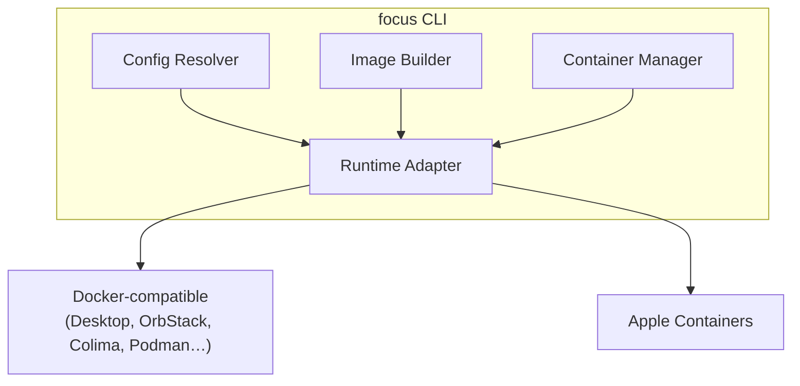

# focus — High-Level Design

## Overview

`focus` is a CLI tool that launches an isolated container scoped to the current working directory. The goal is a frictionless way to drop into a reproducible, tool-configured environment for any project without granting the container access to the broader host filesystem.

```
$ cd ~/dev/myproject
$ focus
[focus] launching myproject...
dev@myproject:/focus $
```

---

## Core Concepts

### Directory Scope

The container sees exactly one host path: the current directory, mounted at `/focus`. No other host paths are exposed by default. This is the defining constraint that keeps the environment clean and auditable.

### Tool Profiles

A tool profile is a named set of packages and configuration that can be composed together. Examples: `claude-code`, `git`, `node`, `python`, `rust`, `ripgrep`. Profiles can be predefined by focus or user-defined. A project declares which profiles it wants; focus assembles the environment from those declarations.

### Persistent Config Volumes

Tool configurations that need to survive across container runs — API tokens, SSH keys, coding harness auth, dotfiles — are stored in named persistent volumes managed by focus, not inside the project directory. These volumes are mounted into the container at the appropriate locations (e.g. `~/.claude`, `~/.ssh`, `~/.gitconfig`).

### Runtime Abstraction

focus does not depend on a single container runtime. It supports multiple backends through a thin abstraction layer. The active backend is a user-level preference.

---

## User Experience

### Launching

```
$ focus            # start or attach to the container for this directory
$ focus run        # same as above (explicit form)
$ focus stop       # stop the container for this directory
$ focus status     # show whether a container is running for this directory
```

### Shell Access

When invoked interactively, `focus` drops the user into a shell inside the container. When invoked with a command, it runs that command non-interactively:

```
$ focus -- rg "TODO" --type ts
```

### Per-Project Configuration

A `.focus.yaml` file at the project root declares the environment:

```yaml
tools:
  - git
  - ripgrep
  - node
  - claude-code

runtime: auto   # auto | docker | apple-containers
```

The file is committed to the project repo, making the environment reproducible for any developer using focus.

### Global Configuration

A `~/.config/focus/config.yaml` file holds user-level defaults: preferred runtime, default tool set, proxy settings, etc. Per-project config overrides globals. The path can be overridden by setting `$XDG_CONFIG_HOME`.

---

## Architecture

### Components



**Config Resolver** — merges global config, per-project `.focus.yaml`, and CLI flags into a single resolved configuration for the run.

**Image Builder** — given a resolved tool list, produces a container image. Uses a layer-cache strategy so repeated runs with the same tool set are instant.

**Container Manager** — tracks which containers are running for which directories; handles start, attach, stop, and cleanup.

**Runtime Adapter** — the interface each backend implements. Decouples the rest of the system from runtime-specific CLI or API details.

### Container Identity

A container is identified by the combination of the resolved project directory path and the active tool configuration. If a container for the current directory is already running with the same configuration, `focus` attaches to it. If the configuration changed, `focus` offers to rebuild.

### Volume Map

| Host location | Mount path in container | Purpose |
|---|---|---|
| Current directory | `/focus` | Project files |
| `~/.local/share/focus/volumes/claude/` | `~/.claude` | Claude Code auth & config |
| `~/.local/share/focus/volumes/ssh/` | `~/.ssh` | SSH keys |
| `~/.local/share/focus/volumes/git/` | `/etc/gitconfig` (read-only) | Git identity |
| Per-tool volumes | Tool-specific paths | Other tool state |

Volumes are created once on first use and reused across all containers. The base path respects `$XDG_DATA_HOME`.

---

## Runtime Backends

### Docker-compatible

The default backend on Linux and WSL2, and a fallback on macOS when Apple Containers is not available. focus invokes the `docker` CLI and works with any runtime that integrates via Docker contexts — including Docker Desktop, OrbStack, Colima, and Podman (in Docker-compatible mode). Switching runtimes requires no focus configuration: the active Docker context is used automatically, just as it would be for any other Docker-based tool.

### Apple Containers

The preferred backend on macOS when available. Uses the native `container` CLI introduced in macOS 26 (Tahoe). Lighter weight than Docker Desktop, fully integrated with macOS permissions model.

### Backend Selection

The `runtime` field in config accepts:

- `auto` — prefer Apple Containers on macOS if available, otherwise Docker-compatible
- `docker` — force Docker-compatible (uses active Docker context)
- `apple-containers` — force Apple Containers (macOS only)

---

## Tool Profile System

### Predefined Profiles

focus ships a catalog of predefined profiles covering common developer tools. Each profile declares what it installs and which persistent volume paths it needs. Examples:

| Profile | Installs | Persists |
|---|---|---|
| `git` | git | `~/.gitconfig` |
| `claude-code` | Node.js, Claude Code CLI | `~/.claude` |
| `ripgrep` | rg | — |
| `node` | Node.js, pnpm | `~/.pnpm-store` |
| `python` | Python, uv | `~/.cache/uv` |
| `rust` | rustup, cargo | `~/.cargo`, `~/.rustup` |
| `ssh` | openssh-client | `~/.ssh` |

### Custom Profiles

Users can define custom profiles in `~/.config/focus/profiles/`. A profile is a small descriptor: what to install and what volumes to persist.

### Base Image

focus uses a minimal, well-maintained base image (e.g. Debian slim or Ubuntu LTS). All tool profiles install on top of this base. The base image version is pinned in global config and updated explicitly.

---

## Security Model

- The container uses bridge networking with outbound internet access via NAT. Host-local services (e.g. `localhost:5432`) are not reachable by default. Setting `network: none` in `.focus.yaml` disables all networking for air-gapped scenarios.
- No host paths beyond `/focus` and declared volumes are accessible.
- The container user is a non-root user by default; `sudo` may be available optionally.
- Persistent volumes are owned by the host user and bind-mounted with appropriate permissions.
- No Docker socket or privileged mode is exposed to the container.

---

## Supported Platforms

The supported platforms are **macOS** and **Linux** (including WSL2). Native Windows (Win32) is not a target. No Windows-specific code paths, compatibility shims, or workarounds should be introduced.

### macOS

Primary platform. Apple Containers backend preferred. XDG paths are used even on macOS — this is idiomatic for developer CLI tools and avoids cluttering `~/Library`. `~/.cache/focus/` (image layers) is naturally excluded from Time Machine backups since macOS excludes `~/.cache` by default; `~/.local/share/focus/volumes/` (persistent tool config) is included in backups.

### Linux / WSL2

Docker or Podman backend. Volume paths are the same. On WSL2, the current directory must be on the Linux filesystem (not a Windows mount) for volume performance to be acceptable.

---

## Directory Layout (XDG)

focus follows the [XDG Base Directory Specification](https://specifications.freedesktop.org/basedir-spec/latest/). All paths respect the corresponding `$XDG_*` environment variable if set.

| Path | XDG variable | Contents |
|---|---|---|
| `~/.config/focus/` | `$XDG_CONFIG_HOME` | `config.yaml`, custom profiles |
| `~/.local/share/focus/volumes/` | `$XDG_DATA_HOME` | Persistent tool volumes (auth, SSH keys, etc.) |
| `~/.cache/focus/` | `$XDG_CACHE_HOME` | Built image layer cache (safe to delete) |
| `~/.local/state/focus/` | `$XDG_STATE_HOME` | Running container registry, command history |

---

## Non-Goals

- Multi-directory or multi-repo containers (one directory = one container)
- Network service orchestration (focus is not docker-compose)
- Container image publication or registry integration
- GUI or TUI (CLI only)
- Native Windows (Win32) support
